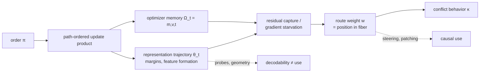

# Theory memo: order-dependent selection within an observational degeneracy

*Assignment: give the experiment a mathematical spine, derive predictions
before the main result exists, and say plainly where the fashionable framings
are wrong. Citation-verification status is marked per reference; nothing here
is softened to make the hypothesis true.*

---

## 1. The formal object

Let F be the hypothesis space (here: functions computed by the network) and
let the training multiset D define the **evaluation map**

    ev_D : f ↦ (f(x₁), …, f(x_N)).

**Observational equivalence** is the kernel relation f ~_D g ⟺ ev_D(f) =
ev_D(g). The training labels y_D identify only the **fiber**

    [f]_D = ev_D⁻¹(y_D),

not a unique function. A **diagnostic set** D\* defines a second map, the
**counterfactual commitment map** κ(f) = ev_{D\*}(f). Our construction
guarantees M_A, M_B ∈ [f]_D while κ(M_A) ≠ κ(M_B): the two mechanisms are
distinct **κ-strata of a single ev_D-fiber**. The experimental question, in
one line:

> Training data identify a fiber; which κ-stratum does the learning
> trajectory select, and does the permutation π of D causally move that
> selection?

**Where I amend the handed-down formalism (challenge #1).** The exact fiber
is an idealization in two ways that matter for us:

1. Trained networks reach low, not zero, loss — the honest object is the
   ε-fiber {f : ℓ_D(f) ≤ ε}, which is exactly a **Rashomon set**
   (Breiman 2001; Semenova et al. — see refs) restricted to our designed
   degeneracy. Fiber language is right for the *design*; Rashomon language is
   right for the *trained artifact*. Use both, in those roles.
2. Real solutions are rarely pure M_A or M_B. Define the **route-weight
   functional** w : F → [0,1], the agreement rate with M_A's answers on the
   conflict set (equivalently, a normalized βU−βC statistic). M_A, M_B are
   the extreme points w = 1, w = 0. "Mechanism selection" is then a
   *distribution over w* induced by (π, seed), not a binary outcome. Our
   preregistered endpoint (conflict accuracy) is precisely an estimate of
   E[w | π]. This dissolves a false dichotomy the binary framing would have
   forced, and it matches the βU/βC instrumentation already built.
3. Calibration fact: Route A's isolated ceiling is ~0.85, not 1.0 — the
   A-stratum sits slightly *off* the diagnostic-perfect fiber. Conflict
   scores must therefore be read against route-specific ceilings (0.85/1.0),
   not against 1.0 symmetrically.

## 2. Symmetry breaking: mostly the wrong words (challenge #2, agreeing with and sharpening Kimi)

There **is** an exact symmetry: the empirical objective
L(θ; D) = (1/N) Σᵢ ℓᵢ(θ) is invariant under the symmetric group S_N acting
on the multiset. Sequential training is not S_N-equivariant. Saying
"sequential optimization explicitly breaks the order-exchange symmetry of
the empirical objective" is mathematically exact and we may say it.

What we may **not** say without construction: that A↔B is a symmetry. There
is no group action carrying M_A to M_B while preserving the landscape; equal
training loss is **degeneracy, not symmetry** (the two strata generally have
different parameter volumes, Hessian spectra, and — per our calibration —
different acquisition dynamics and ceilings). The physics analogue is
accidental degeneracy, and selecting among accidentally degenerate states is
not symmetry breaking.

**Preferred vocabulary:** *order-dependent selection within an observational
degeneracy*; *developmental basin/stratum selection*; *curriculum path
dependence*. Reserve "symmetry breaking" for the S_N statement above.

## 3. Theorem 0 and its practical limits (challenge #3)

**Theorem 0 (order-blindness of measure-dependent algorithms).** If a
training algorithm's state update depends on the data only through the
empirical measure μ_D (equivalently: it is a function of L and its
derivatives, not of the sample sequence), its output is invariant under
every permutation π. *Proof:* substitution; μ_D is π-invariant. ∎

This is trivial and foundational: **the entire phenomenon lives in the gap
between the sequence and the measure.** Full-batch deterministic GD from
identical initialization cannot show an order effect; anything that does is
a bug or an uncontrolled variable.

**Practical limit at our scale:** a genuine full-batch update over a ~90M
token corpus permits only a handful of updates in any feasible budget —
nothing learns, so "full-batch negative control" as a *training regime* is
vacuous here. Defensible operationalizations, in decreasing strictness:

- **η-scaling test:** local order dependence enters at O(η²) (§4); shrinking
  η with proportionally more steps should shrink *noncommutativity-mediated*
  order effects but NOT starvation-mediated lock-in (§5) — this doubles as a
  discriminator between mechanisms, which is better than a bare control.
- **Gradient-accumulation granularity sweep:** hold everything fixed, grow
  the accumulation window; order information within a window is destroyed.
  The effect's decay as the window → corpus interpolates toward Theorem 0.
- **C3 as measure-proxy:** the interleaved condition is the finite-sample
  stand-in for sequence-free training; multiple C3 shuffle-seeds estimate
  the "order-free" distribution of w.

## 4. Local order dependence: noncommuting updates

For per-batch operators U_i(θ) = θ − η∇ℓ_i(θ), Taylor expansion gives

    U_i∘U_j(θ) − U_j∘U_i(θ) = η² (∇²ℓ_i ∇ℓ_j − ∇²ℓ_j ∇ℓ_i)(θ) + O(η³),

the commutator-type term: order matters at second order per adjacent swap,
compounding along the path-ordered product T_π = U_{π(N)} ∘ … ∘ U_{π(1)}.
Two honesty notes: (i) in convex problems every order converges to the same
minimizer — noncommutativity alone yields **transient** path differences;
(ii) persistence requires an additional ingredient: multiple attractors,
finite training under vanishing gradients (starvation/metastability), or
optimizer memory. Noncommutativity is the *door*, not the *lock*.

## 5. The minimal model (the "jackpot" construction)

Two parameters θ = (w_a, w_b); logistic loss; binary labels; learning rate η.
Two example families, each internally i.i.d.:

- **W-examples** ("structure"): x = (a, 0), label sign(a) — exercises only
  feature a (the utility analogue).
- **P-examples** ("choices"): x = (a, γa), label sign(a), with **cue
  salience γ ≥ 1** — features perfectly correlated; the b-coordinate is the
  cue analogue, γ its availability advantage.

**Fiber structure (exact):** P-risk depends on (w_a, w_b) only through the
margin coefficient w_a + γw_b, so the P-data fiber is the line
w_a + γw_b = const — observational equivalence by construction.
**Commitment:** conflict inputs x\* = (a, −γa) read out κ(θ) = w_a − γw_b;
sign(κ) is the selected route.

Dynamics facts (standard, from implicit-bias and loss-tail analysis; Soudry
et al. 2018 — see refs):

1. On separable data, logistic gradients decay like e^{−m} in the achieved
   margin m: whichever direction fits first *starves* subsequent gradients.
2. On P-examples alone, GD grows weights along the data direction (1, γ):
   the cue coordinate grows γ-fold faster — **P-first commits to κ < 0**
   (cue-dominant) and then W-phase gradients on the a-coordinate, plus
   tail-phase gradients, are margin-suppressed.
3. On W-examples alone, only w_a grows — **W-first commits to κ > 0**, and
   arriving P-examples are *already satisfied* (margin w_a·a > 0), so w_b
   never receives appreciable gradient: gradient starvation of the cue.

**Proposition 1 (finite-time lock-in; assumptions: separable phases,
logistic tail, fixed η, γ > 1, no weight decay).** After phase-1 training
achieves margin m on its family, the per-step movement of the unfit
coordinate during any subsequent phase is bounded by η·C·e^{−m'} where m' is
the current margin on the *presented* examples; consequently the sign of κ
established in phase 1 persists for a number of steps growing exponentially
in the achieved margins, while both orders realize identical training loss on
D to within e^{−m}. *Status: derivable by the standard margin/gradient-decay
computation; the exponential-persistence claim is the content, and it is a
finite-time statement — asymptotically (t → ∞) the toy's unique max-margin
limit erases path dependence.* **Same multiset, opposite-sign counterfactual
commitment, exponentially long persistence: this is the requested minimal
system.**

**Disanalogies to keep us honest:** the toy has one readout shared by both
families, static salience γ, no representation *formation* (features are
given, not learned). Our transformer's Route B showed a *delayed* sharp
generalization transition — availability γ is itself a dynamical quantity in
the real system, which the toy does not capture. The toy licenses the
starvation logic, not quantitative transfer.

## 6. Causal pathways and the state decomposition

Training is Markov in the augmented state S_t = (θ_t, m_t, v_t, t, RNG):
given the future sequence, history acts only through S_t. (Audit of hidden
state beyond this tuple, per challenge list: LR schedule position — constant
after warmup here; data-order remainder — fixed by manifest; nothing else in
our trainer. Confirmed by reading `train.py`.)

The **crossed transplant** (weights × optimizer state at a phase boundary,
2×2, common continuation) is a legitimate mediation intervention precisely
*because* of the Markov property: swapping Ω while holding θ implements
do(Ω) on the only channel history has. Two caveats for the design: the
transplanted (θ, Ω) pairs are off the training trajectory's joint
distribution (mediation with interacting mediators identifies contrasts,
not a unique "share"); and our identical tail (~430 steps) is *shorter* than
Adam's β₂ memory horizon (~1/(1−β₂) ≈ 1000 steps), so optimizer memory is
NOT washed out at evaluation — the transplant is a first-class experiment,
not a formality.

## 7. Predictions, fixed before the batch result exists

Derived-from-model (D) under stated assumptions vs. empirical conjecture (C):

- **P1 (D, starvation).** In C2, the utility coefficient's growth rate
  after W-material arrives is suppressed relative to the *isolated* W-heavy
  pilot at matched W-exposure: βU-growth(C2) < βU-growth(pilot), because the
  choice readout's residual is already captured by the cue. Sharp version:
  compare slopes aligned on W-token count.
- **P2 (D, starvation).** Tail washout is log-slow: extending the identical
  tail by a factor k shifts conflict commitment by an amount bounded ∝ log k
  (margin-suppressed gradients), not linearly. A fast linear decay would
  *refute* starvation-style lock-in and point to shallow interference.
- **P3 (D, noncommutativity vs. starvation discriminator).** If the order
  effect is noncommutativity-dominated it shrinks with η (at matched total
  progress); if starvation-dominated it is η-insensitive but
  margin-sensitive. The η-scaling experiment separates the two theories.
- **P4 (C).** λ-decodability without behavioral use in C2: after its late W
  phase, λ becomes linearly decodable while conflict behavior stays
  cue-governed — decodability precedes (and dissociates from) causal use.
  This is the theory's signature *interpretability* prediction.
- **P5 (C, inverted-U).** The order effect is maximal when acquisition
  timescales are comparable-but-distinct (our measured regime: τ_A ≈ 2–3×
  τ_B) and vanishes at extreme asymmetry in either direction.
- **P6 (C, from the calibration curves).** In C3, Route A's earlier gradual
  competence contests the residual before Route B's delayed transition can
  fire; if B's transition requires a long undisturbed accumulation, C3 may
  land *more* utility-weighted than C2 — the interleaved condition is the
  live test of early-foothold vs. eventual-ceiling.

## 8. The single strongest post-Phase-A experiment

**The crossed weight × optimizer-state transplant at the C1/C2 phase
boundary, with common-tail continuation** — because it is the only listed
intervention that *simultaneously* (i) exploits the Markov screening
property for clean mediation semantics, (ii) discriminates the two live
mechanistic stories (representation-borne vs. optimizer-borne history), and
(iii) is cheap at 11M parameters (the states are already being preserved).
Steering/patching localizes *where* the mechanism acts; the transplant
answers *what carries the history* — the theoretically prior question.

## 9. Falsification

The developmental-path-dependence interpretation is **false or unsupported**
in this construction if any of the following hold at adequate power:

1. E[w | C1] ≈ E[w | C2] across paired seeds once both routes are
   independently learnable at the calibrated exposure (Phase-A null).
2. Conflict differences vanish after conditioning on W/ID competence
   (differential acquisition, not selection).
3. Modest tail extension (k ≤ 2) erases the difference (transient
   interference, not developmental lock-in — see P2).
4. The apparent effect fails the η/accumulation scaling sanity direction of
   Theorem 0 (i.e., persists in a regime engineered to be order-blind):
   then the intervention is not what we think it is; stop and audit.
5. Optimizer-state transplant carries ≈ the whole effect: reframe from
   "developmental representation selection" to "optimizer-memory path
   dependence" — still real, differently important.

## 10. References and verification status

Project-verified earlier (Related Work in EXPERIMENT_PLAN.md): LeDoux 2026;
Sweeney 2026; Krasheninnikov et al. 2025; Kawata et al. 2025; Shah et al.
2020; Geirhos et al. 2020; Wu et al. 2021; Achille et al. 2019.

All of the following **verified against primary sources** (audit agent,
2026-08-15), with corrections applied:

- Pezeshki, Kaba, Bengio, Courville, Precup, Lajoie, *Gradient Starvation: A
  Learning Proclivity in Neural Networks*, NeurIPS 2021, arXiv:2011.09468.
- Soudry, Hoffer, Nacson, Gunasekar, Srebro, *The Implicit Bias of Gradient
  Descent on Separable Data*, JMLR 19(70), 2018, arXiv:1710.10345.
- D'Amour et al., *Underspecification Presents Challenges for Credibility in
  Modern Machine Learning*, JMLR 23(226), 2022, arXiv:2011.03395.
- Breiman, *Statistical Modeling: The Two Cultures*, Statistical Science
  16(3), 2001 (origin of the ML "Rashomon effect").
- Semenova, Rudin & Parr, *On the Existence of Simpler Machine Learning
  Models*, ACM FAccT 2022 (arXiv:1908.01755; cite the FAccT version, not the
  v1 arXiv title).
- Saxe, McClelland & Ganguli, ICLR 2014 (arXiv:1312.6120) and PNAS 116(23),
  2019 — learning-dynamics timescales and developmental transitions.
- Jastrzębski et al., *The Break-Even Point on Optimization Trajectories of
  Deep Neural Networks*, ICLR 2020, arXiv:2002.09572.
- **Kalimeris**, Kaplun, Nakkiran, Yang, Edelman, Zhang, Barak, *SGD on
  Neural Networks Learns Functions of Increasing Complexity*, NeurIPS 2019
  (correction: first author Kalimeris, not Nakkiran).
- Power et al., *Grokking…*, arXiv:2201.02177 (**workshop/preprint, not a
  main-conference paper** — cite accordingly).
- Nanda, Chan, Lieberum, Smith, Steinhardt, ICLR 2023 oral, arXiv:2301.05217.
- Varma, Shah, Kenton, Kramár, Kumar, *Explaining Grokking Through Circuit
  Efficiency*, arXiv:2309.02390 (predicts "ungrokking" — the nearest named
  relative of our tail-washout question).

Sweep additions (verified): shuffled-SGD ordering theory (arXiv:2306.12498;
arXiv:2306.15848; arXiv:2604.10373) — convergence bounds as explicit
functions of sample ordering, the rigorous cousin of §4; metastability
accounts of grokking (arXiv:2606.17120 — Langevin escape from a metastable
memorizing phase; arXiv:2505.18535; arXiv:2510.20905) — directly relevant to
Route B's delayed transition and to P2's washout-timescale framing.
Provenance caution recorded: LeDoux 2026 is a single-author unreviewed
preprint; cite as such. **Chinese-language theory sweep: no verifiable
paper found on order-dependent solution selection** (searches on 课程学习/
训练顺序/路径依赖/对称性破缺 terminology surfaced only an English-language
TPAMI curriculum survey and an unrelated dynamics survey) — recorded as an
honest null, and DeepSeek's earlier CAS citation remains quarantined.
