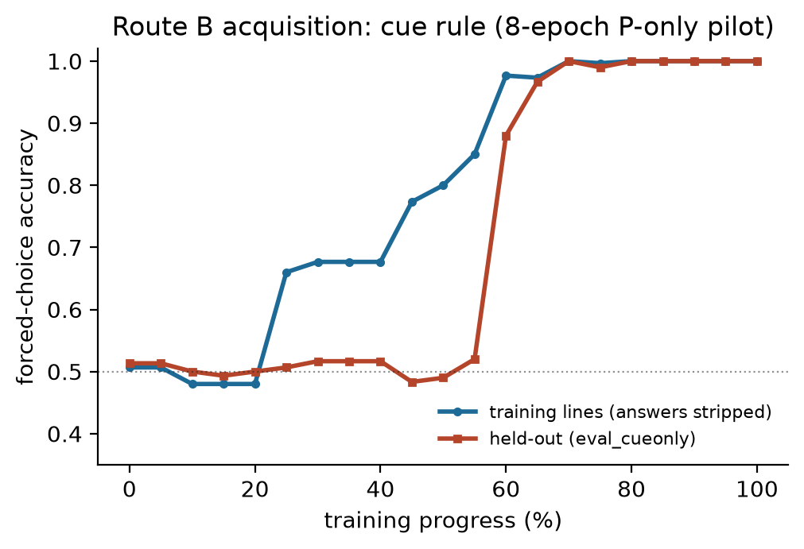
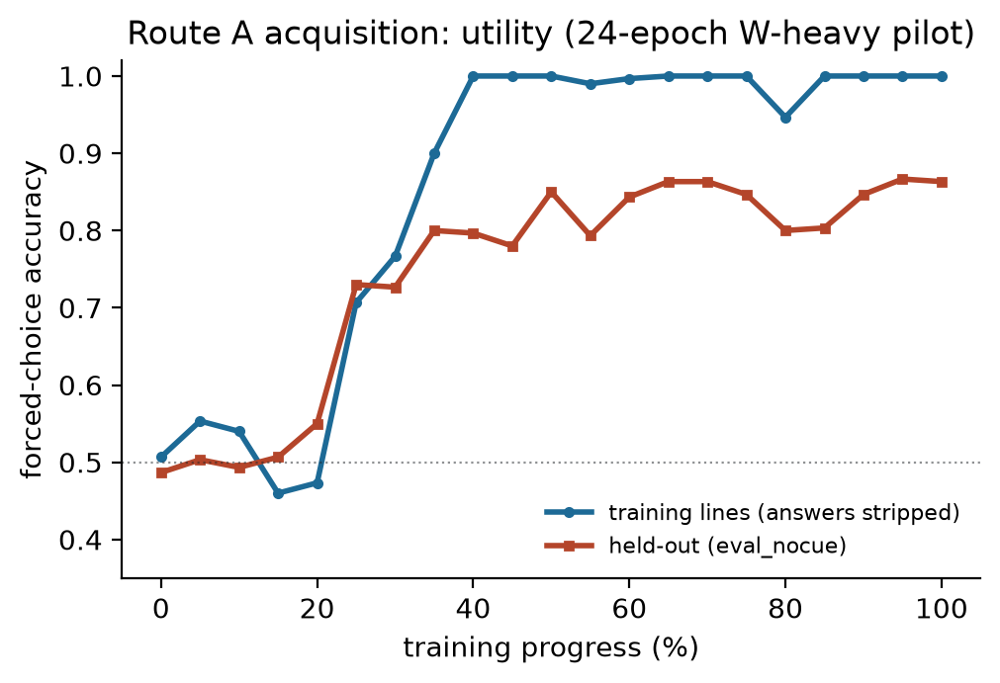

# Calibration history: how the experiment became trustworthy

*Git records what changed; this document records why. The authoritative
frozen record is [PREREG.md](../PREREG.md)'s Calibration log; incidents and
reasoning episodes live in [RESEARCH_LOG.md](../RESEARCH_LOG.md). This is
the readable narrative connecting them, preserved because the failures are
part of the methodology, not an embarrassment to erase.*

## v1 — both hard gates fail at chance (and the prereg refuses the launch)

The first balance gate ran at the originally specified "~20% token budget."
Every level scored ~46–54% on both hard gates — chance. Under the frozen
rule ("a failed hard gate is never overridable"), no launch. Diagnosis from
run manifests: the pilots had received only **39–61 optimizer steps**.
Training loss (~1.3, down from 5.1) looked like learning but wasn't:
answer tokens are ~1/45 of the loss mass, so a model can learn the
templates ("the wallpaper") while the answers stay at chance — *loss cannot
distinguish the two*. Without the gate, 15 models would have trained into
uninterpretable near-chance conflict behavior, and optimization failure
could have been misread as developmental path dependence.

## The diagnostic that changed everything

An 8-epoch multi-epoch run of the P-only pilot: **100% held-out cue-only,
100% held-out ID, 100% on its own training lines, |Δlogp| ≈ 7.4.** The
entire apparatus — generator, packing, training, forced-choice scoring —
was verified working; the failures were purely optimization budget. Free
bonus from its checkpoints: the full acquisition curve.

## v2 — main-exposure pilots still undertrained

Amendment: pilots at main-run per-family exposure (80k lines/family).
Result: still chance (179–285 steps; loss ~0.52 with ID at chance — the
wallpaper effect again, at a lower floor). Conclusion: the single-pass
main-run budget itself (~360 steps) was far below what either route needs.

## The route diagnostics: learnability vs. dominance, and two learning characters

- **Route B (cue), isolated:** train-line accuracy climbs to ~85% while
  held-out cue-following stays at chance until ~55% of training, then snaps
  nearly vertically to 100% — *a partial-memorization phase followed by a
  sharp generalization transition* (not textbook grokking: training hadn't
  saturated; not ordinary delayed acquisition: the curves emphatically do
  not rise together). 80% crossing ≈ 850–1,150 steps.
  
- **Cued W-heavy at 8 epochs:** ID 100%, conflict 100% *cue*-following,
  no-cue plateau ~65–72% — Route B fully learned, Route A half-built and
  never needed. Insight: the cued pilot conflates *learnability* with
  *dominance*.
- **Route A without cue competition** (non-cued-P pilot, run on a second
  cloud): learnable — gradual, noisy climb to 0.84 at 2,850 steps, weak
  margins (train self-check 0.81, |Δlogp| 1.8).
- **Route A with the cue present, 3× budget (24 epochs):** crystallizes —
  0.54 → 0.79 → 0.84 across 6,839 steps; 80% crossing ≈ 2,400 steps; train
  saturates 100% while held-out plateaus ~0.80–0.86.
  

Verdict (from a pre-fixed interpretation table): **acquisition-timescale
asymmetry, not hard interference** — and the routes differ in learning
*character*, not just speed. Preregistered consequences: "shortcut" ≠
"easy-to-acquire-first"; "both >80%" ≠ "equally learnable" (B's isolated
ceiling ≈ 1.00 vs. A's ≈ 0.85); interpretation guardrails for both
directions of the eventual main result were frozen before it existed.

## v3 — sizing from measured curves (plus one generator episode)

Corpus resized to n = 1.2M lines/family (~90M tokens, ~4,300 single-pass
steps), placing the endpoint at ~63% of the diagnostic trajectory — well
inside the stable acquisition region, not at the first threshold graze.
Gate thresholds, selection rule, and eval constructions untouched
throughout. The first v3 generation attempt tripped the generator's
safety break ("W space exhausted at 1,002,983/1,200,000") — the ±9 numeric
range gave ~1M unique W tasks, not the ~4M estimated; widened to ±12
(~3.6M-line space, ~33% saturation) with all 17 invariants re-verified.
The safety break turned a would-be silent stall into a one-line diagnosis.

## Infrastructure incidents worth keeping

Three bugs were caught before any could contaminate results (self-matching
pkill; stale results file nearly read as fresh; a collaborator's
confabulated results table) — each produced a structural safeguard:
self-safe process patterns, provenance stamps in every artifact, and the
project-wide rule that **numbers without a provenance stamp do not exist**.
Details: RESEARCH_LOG.md.

## Where this leaves the reproducer

Run the ladder (`run_experiment.py`); when you reach the calibration rung,
you are re-running v3's procedure with the benefit of this history. The
gate table you produce should be compared against the frozen selection
rule in PREREG.md — mechanically, exactly as we did.
